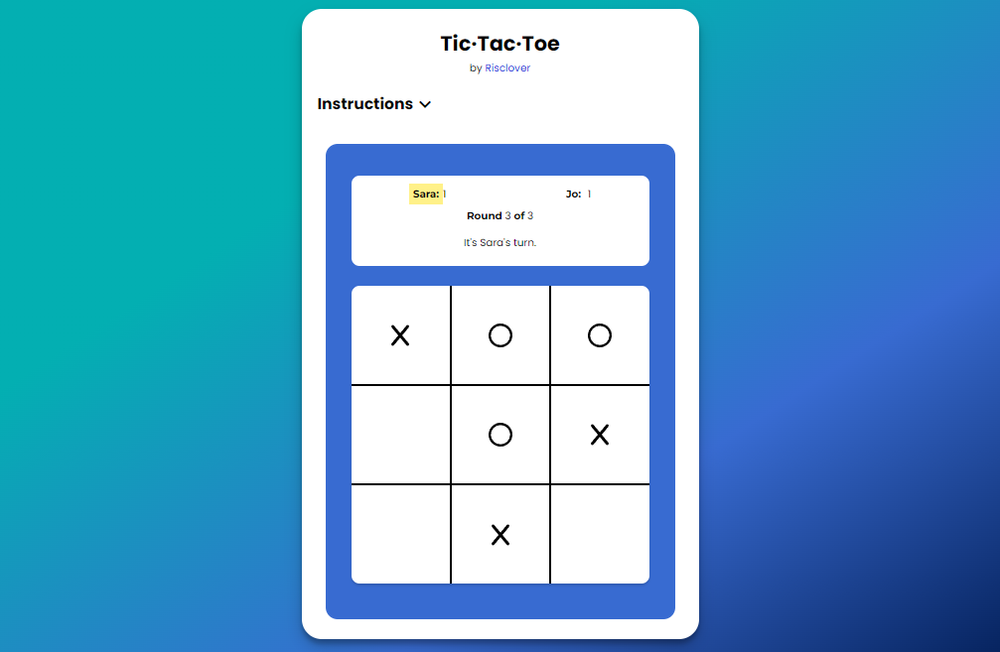
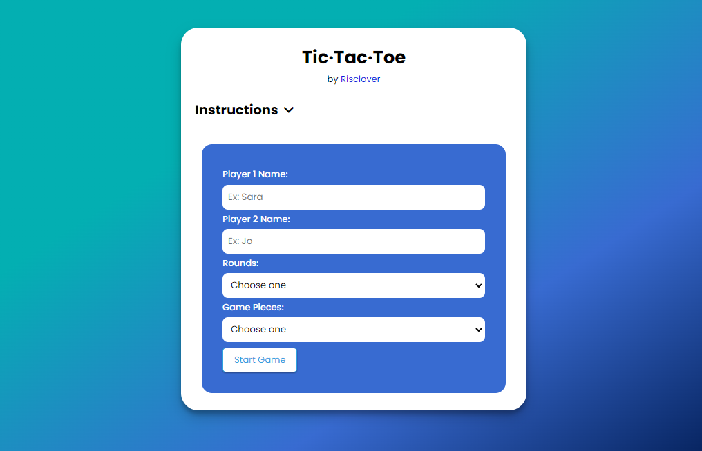

# Tic-Tac-Toe
 
## Table of Contents
  1. [Description](#description)
  2. [Updates](#updates)
  3. [How to Play](#how-to-play)
     - [Quick Start](#quick-start)
     - [Custom Game](#custom-game)
     - [How to Play](#how-to-play-1)
     - [Using Custom Markers](#using-custom-markers)
  4. [Build](#build)
  5. [Links](#links)

## Description
[Back to Top](#table-of-contents)

This is Tic Tac Toe, the classic game that we've all played as children. Two players play against one another on one computer. Choose how many rounds you want to play, use custom markers, and be the first to 3 in a row! Testing



## Updates
[Back to Top](#table-of-contents)

* **04/05/22**: Game officially released (v1.0)!

## How to Play
[Back to Top](#table-of-contents)

### Quick Start
Click the "Start Game" button at the bottom of the form without filling any details out if you want to start a quick game. 

Doing so will start a **1-round game** with **Player 1 as X** and **Player 2 as O**.

### Custom Game



Fill in form elements for any settings you wish to customize.

1. Fill in each player's name. Leaving these fields blank will result in the players being called "Player 1" and "Player 2".
   
   

2. Enter how many rounds you'd like to play. Leaving this dropdown menu blank will result in a 1-round game.

   
   
   * **Single Round**: Play a 1-round game.
   * **Pick Rounds**: Decide how many rounds you want to play. Input this number into the input box that appears after making this selection.
  
      
   * **Ongoing Rounds**: Play up to the maximum amount of rounds possible (9,007,199,254,740,991 rounds). Click the "Stop Game" button whenever you decide you're done.
3. Pick your markers. Leaving this blank will result in Player 1 playing X's and Player 2 playing O's. 
   
   
    - **Classic (X's and O's)**: Use the classic X and O markers. Decide who gets what.
  
      

    - **Custom**: Pick unique markers via the Fontawesome icons collection. (For more detail on how to do this, refer to the [Using Custom Markers](#using-custom-markers) section.)

      
### How to Play
1. Once the game begins, players will click on squares to set their markers.
2. The first player to get 3 in a row in any direction wins.
3. Make sure that you watch the top area to see who's turn it is. 
   
   
   
   (*If ever in doubt, not only is there an announcement for whose turn it is, but that player's name will also be highlighted in yellow.*)
    - **First round**: The player whose marker is X goes first. 
        - If you're using custom markers, or if you didn't choose any markers, then Player 1 will go first by default.
    - **Subsequent rounds**: Players will alternate going first each round, so if Player 1 went first last round, Player 2 will go first this round.
4. If you fill the board with markers and nobody gets 3 in a row, this will result in a draw. If you're playing a designated number of rounds, note that this *will* count as a round played.
5. The game ends when one of the following occurs:
   - 1 Round: When a player gets 3 in a row or when players tie.
   - Picked Rounds: When the number of rounds have been played, the player with the highest score wins.
   - Ongoing Rounds: Goes on infinitely, or until the "Stop Game" button is pressed (located beneath the gameboard during an "Ongoing" game).
6. If, when the game ends, players have identical scores, the game will offer a tiebreaker round.
   
   
   - Whoever wins the tiebreaker round wins the whole thing.
   - If players get another tie, additional tiebreaker rounds will continue to be offered until someone scores a point, or until the players decline the tiebreaker round.

### Using Custom Markers
You have the option of using custom markers if you want. This game uses the Fontawesome library of icons to accomplish this. Simply follow these instructions.

1. Select the "Custom" option in the "Game pieces" dropdown menu. Doing so will make two new input boxes appear (one for each player's marker).
2. Go to the Fontawesome website at https://www.fontawesome.com/.
3. Click 'Icons' in the top bar.
4. Make sure that the version is set to the latest.
5. Use the filters to search for free icons only. **Pro icons will NOT work.**
6. When you find an icon, click on it. This will make a window pop up.
7. You should see a code snippet in the following format. Click on it to copy it to your clipboard (or copy it another way).

    ```html
    <i class="fa-small fa-cactus"></i>
    ```
8. Paste the code snippet into the appropriate player's custom marker input box.

As long as the version number is correct, and as long as you use a free icon, this should 100% work!


## Build
[Back to Top](#table-of-contents)

This game was built using the following languages:
- HTML
- CSS
- JavaScript

If you would like to read more about the making of this project, check out my blog post on the topic ([Project Breakdown: Tic-Tac-Toe](https://risclover.github.io/)).

## Links
[Back to Top](#table-of-contents)

* [Live site](https://risclover.github.io/Tic-Tac-Toe)
* [Code repo](https://www.github.com/Risclover/Tic-Tac-Toe) (You are here!)
* [Project Breakdown](https://risclover.github.io)